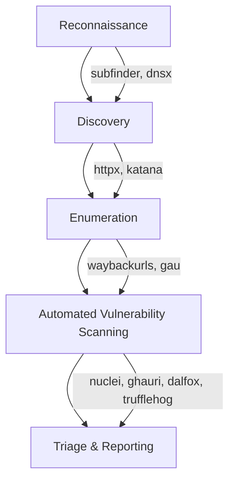

# 🕵️ Bug Bounty Hunting Methodology (2025)

> A streamlined, **fully automated** bug-bounty methodology focused on:
>
> - avoiding duplicate tools (one best tool per job)
> - maximizing automation
> - producing copy-paste-ready commands

---

## Overview

This repository documents an end-to-end automation workflow for reconnaissance, enumeration, and automated vulnerability scanning — finishing with triage and reporting. The workflow emphasizes _one good tool per task_ and storing all output in structured files for easy triage.

**High-level flow:** Reconnaissance → Discovery → Enumeration → Automated Scanning → Triage & Reporting



---

## Table of Contents

- [Prerequisites](#prerequisites)
- [Quick Workflow (one-line)](#quick-workflow-one-line)
- [Reconnaissance & Discovery](#reconnaissance-and-discovery)
- [Enumeration & URL Collection](#enumeration-and-url-collection)
- [Automated Vulnerability Scanning (by category)](#automated-vulnerability-scanning-by-category)
- [Output, Triage & Reporting](#output-triage--reporting)
- [Best Practices & Notes](#best-practices--notes)
- [Sample scripts](#sample-scripts)
- [Tool matrix](#tool-matrix)
- [Triage & Reporting Checklist](#triage-and-reporting-checklist)
- [Example usage](#example-usage)
- [Final Notes](#final-notes)
- [License](#license)

---

## Prerequisites

Install the command-line tools used in this workflow (examples — choose package manager or binaries appropriate for your environment):

- `subfinder`, `dnsx`, `httpx` (projectdiscovery)
- `katana` (or your preferred crawler)
- `waybackurls`, `gau`
- `nuclei` + templates
- `ghauri` and/or `sqlmap`
- `dalfox` (XSS)
- `trufflehog` (secrets)
- `jq`, `parallel`, `ripgrep` (optional helpers)

> Replace `target.txt` with your allowed-scope targets. Only run against assets you are authorized to test.

---

## Quick Workflow (one-line)

```bash
# Discover -> Resolve -> Probe -> Crawl -> Collect -> Scan
subfinder -dL target.txt -o subdomains.txt \
&& cat subdomains.txt "${TARGET_FILE}" | sort -u > subdomains_final.txt \
&& dnsx -l subdomains.txt -o resolved.txt \
&& httpx -l resolved_http.txt -silent -o http_alive.txt \
&& httpx -l resolved_http.txt -silent -status-code -title -tech-detect -o http_details.txt\
&& katana -list -silent http_alive.txt -o urls.txt \
&& waybackurls -l resolved.txt > wayback.txt \
&& gau -l resolved.txt > gau.txt \
&& cat urls.txt wayback.txt gau.txt | sort -u > all_urls.txt \
&& cat all_urls.txt | grep -Ei "\.js($|\?)" > js_files.txt \
&& nuclei -l all_urls.txt -t ~/nuclei-templates/ -severity critical,high,medium -o nuclei_findings.txt
```

---

## 1 — Reconnaissance and Discovery

### Subdomain enumeration

```bash
subfinder -dL target.txt -o subdomains.txt
```

### DNS resolution

```bash
dnsx -l subdomains.txt -o resolved.txt
```

### Probe live HTTP(S) services

```bash
httpx -l resolved_http.txt -silent -o http_alive.txt
httpx -l resolved_http.txt -silent -status-code -title -tech-detect -o http_details.txt
```

---

## 2 — Enumeration and URL collection

### Crawl for endpoints/parameters

```bash
katana -list http_alive.txt -o urls.txt
```

### Historical URL collection

```bash
waybackurls -l resolved.txt > wayback.txt
gau -l resolved.txt > gau.txt
```

### Consolidate and deduplicate

```bash
cat urls.txt wayback.txt gau.txt | sort -u > all_urls.txt
# Extract JS files for secrets scanning
cat all_urls.txt | grep -Ei "\.js($|\?)" > js_files.txt
```

---

## 3 — Automated Vulnerability Scanning (category-specific)

> Save outputs to files. Prioritize `critical` / `high` severities first during triage.

### General vulnerability & CVE scanning (Nuclei)

```bash
nuclei -l all_urls.txt -t ~/nuclei-templates/ -severity critical,high,medium -o nuclei_findings.txt
```

### SQL Injection (SQLi)

Primary:

```bash
while read url; do
    ghauri -u "$url" --batch
done < "${URLS_FILE}" > sqli_results.txt || true
```

Deeper scan (slower):

```bash
sqlmap -m all_urls.txt --batch --crawl=2 --random-agent -o sqli_deep_results.txt
```

### Cross-Site Scripting (XSS)

```bash
dalfox file all_urls.txt -o xss_results.txt
```

### Local File Inclusion (LFI)

```bash
nuclei -l all_urls.txt -tags lfi -o lfi_results.txt
```

### Remote Code Execution (RCE) / Command Injection

```bash
nuclei -l all_urls.txt -tags rce,command-injection -o rce_results.txt
```

### Cross-Site Request Forgery (CSRF)

```bash
nuclei -l all_urls.txt -tags csrf -o csrf_results.txt
```

### Open Redirects

```bash
nuclei -l all_urls.txt -tags open-redirect -o redirect_results.txt
```

### Path Traversal

```bash
nuclei -l all_urls.txt -tags path-traversal -o traversal_results.txt
```

### Server-Side Request Forgery (SSRF)

```bash
nuclei -l all_urls.txt -tags ssrf -o ssrf_results.txt
```

### Insecure Deserialization

```bash
nuclei -l all_urls.txt -tags deserialization -o deserialization_results.txt
```

### Sensitive Data Exposure / Secrets

Scan JavaScript and other files for secrets:

```bash
# For trufflehog filesystem mode, make sure you've downloaded or fetched the JS files first
# Example: download JS files list then run trufflehog
trufflehog filesystem js_files.txt --json > secrets_trufflehog.json
```

### Misconfigurations & Default Credentials

```bash
nuclei -l all_urls.txt -tags misconfiguration,default-credentials,exposures -o misconfig_results.txt
```

---

## 4 — Output and Triage

- Each scanner writes structured output (`.txt`/`.json`) to the repo root.
- Prioritize by severity (`critical` → `high` → `medium`) and by exploitability.
- Validate manually or with safer, non-destructive verification steps before reporting to avoid false positives.

Example to show high/critical in Nuclei output:

```bash
grep -Ei "critical|high" nuclei_findings.txt | sed 's/\\t/    /g'
```

---

## Best Practices & Notes

- **Scope & Authorization:** Always confirm scope and written authorization. Never scan assets out-of-scope.
- **One tool per job:** Use the most effective tool for each stage to avoid duplicate results and wasted time.
- **Rate limiting & politeness:** Respect rate limits — adjust concurrency flags when needed.
- **Result deduplication:** Use `sort -u`, `jq`, and `awk` to normalize and deduplicate outputs.
- **Template maintenance:** Keep `nuclei` templates up to date.
- **Avoid noisy verification:** For triage confirmability, prefer non-destructive validation (response fingerprinting) before active exploitation.
- **Logging & reproducibility:** Store command outputs and exact commands used for every engagement to reproduce and audit findings.

---

## Sample scripts

### `run_recon.sh` (example)

```bash

#!/usr/bin/env bash
set -euo pipefail

# Input file with targets
TARGET_FILE="${1:-target.txt}"

echo "[*] Starting Recon for targets in $TARGET_FILE"

# 1️⃣ Subdomain enumeration
echo "[*] Running subfinder..."
subfinder -dL "${TARGET_FILE}" -o subdomains.txt

# Include original targets to ensure nothing is missed
cat subdomains.txt "${TARGET_FILE}" | sort -u > subdomains_final.txt

# 2️⃣ DNS resolution
echo "[*] Running dnsx..."
dnsx -l subdomains_final.txt -o resolved.txt

# 3️⃣ Prepare URLs with protocol
echo "[*] Preparing URLs with https://"
sed 's|^|https://|' resolved.txt | sort -u > resolved_http.txt

# 4️⃣ HTTP probing (using httpx properly)
echo "[*] Probing live HTTP servers..."
# Save clean URLs for katana, and detailed output separately
httpx -l resolved_http.txt -silent -o http_alive.txt
httpx -l resolved_http.txt -silent -status-code -title -tech-detect -o http_details.txt

# 5️⃣ Katana URL discovery
echo "[*] Running katana for crawling..."
katana -list http_alive.txt -o urls.txt

# 6️⃣ Wayback URLs
echo "[*] Fetching Wayback URLs..."
while read host; do
    waybackurls "$host"
done < resolved.txt > wayback.txt

# 7️⃣ GAU (GetAllUrls)
echo "[*] Fetching GAU URLs..."
while read host; do
    gau "$host"
done < resolved.txt > gau.txt

# 8️⃣ Combine all URLs
echo "[*] Combining all URLs..."
cat urls.txt wayback.txt gau.txt | sort -u > all_urls.txt

# 9️⃣ Extract JavaScript files
echo "[*] Extracting JS files..."
grep -Ei "\.js($|\?)" all_urls.txt > js_files.txt

echo "[✅] Recon complete!"
echo "All URLs: all_urls.txt"
echo "JS files: js_files.txt"
```

### `run_scanning.sh` (example)

```bash
#!/usr/bin/env bash
set -euo pipefail

URLS_FILE="${1:-all_urls.txt}"

# Nuclei scan (broad)
nuclei -l "${URLS_FILE}" -t ~/nuclei-templates/ -severity critical,high,medium -o nuclei_findings.txt

# Category scans
while read url; do
    ghauri -u "$url" --batch
done < "${URLS_FILE}" > sqli_results.txt || true
dalfox file "${URLS_FILE}" -o xss_results.txt || true
nuclei -l "${URLS_FILE}" -tags lfi -o lfi_results.txt || true
nuclei -l "${URLS_FILE}" -tags rce,command-injection -o rce_results.txt || true
nuclei -l "${URLS_FILE}" -tags ssrf -o ssrf_results.txt || true

# Secrets
trufflehog filesystem js_files.txt --json > secrets_trufflehog.json || true

echo "Scanning finished. Check *_results.txt and nuclei_findings.txt"
```

---

## Tool matrix

| Tool        | Purpose                               |
| ----------- | ------------------------------------- |
| subfinder   | Subdomain enumeration                 |
| dnsx        | DNS resolution                        |
| httpx       | HTTP(S) service detection             |
| katana      | Web crawling / endpoint discovery     |
| waybackurls | Historical URL collection             |
| gau         | Historical URL collection (alternate) |
| nuclei      | Broad vuln & CVE scanning (templates) |
| ghauri      | SQLi scanning (fast)                  |
| sqlmap      | Deep SQLi exploitation testing        |
| dalfox      | XSS scanning / payload testing        |
| trufflehog  | Secrets detection in code/artifacts   |

---

## Triage & Reporting Checklist

1. Confirm scope & authorization.
2. Reproduce with low-impact checks (no blind exploitation).
3. Record PoC steps, HTTP requests/responses, and exact commands.
4. Determine impact, CVSS-ish severity, and mitigation guidance.
5. Draft report, include remediation steps and logs.
6. Submit to program per responsible disclosure rules.

---

## Example usage

```bash
# 1. Set target(s)
echo "example.com" > target.txt

# 2. Run recon
./run_recon.sh target.txt

# 3. Run scanners
./run_scanning.sh all_urls.txt

# 4. Inspect high/critical findings (nuclei)
grep -Ei "critical|high" nuclei_findings.txt
```

---

## Final Notes

- This methodology focuses on _automation-first_ and _one-tool-per-task_ to keep output clean and deduplicated.
- Manual follow-up remains essential for validation and safe proof-of-concept creation.
- Adjust flags and concurrency based on the target and allowed testing windows.

---

## License

Distributed under the MIT License. Use responsibly and only against authorized scope.
